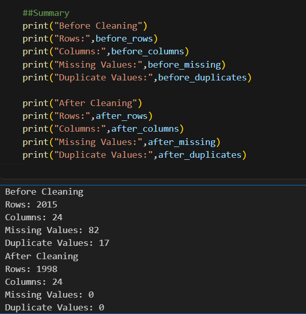

# 🏥 Hospital Data Cleaning Project

## 📌 Project Overview
This project demonstrates the process of cleaning a hospital dataset using python and its libraries. The primary objective was to improve the quality of the data by identifying and resolving common data quality issues. After cleaning, the dataset became more consistent, accurate, and suitable for further analysis and visualization.

## 🎯 Objectives
- Identifying and finding the missing values.
- Remove duplicate records.
- Standardize inconsistent values.
- Verify and correct data types.
- Identify outliers.
- Improve Overall data quality
- Prepare dataset for analysis.

## 🛠 Tools & Technologies
- Python
- Pandas
- NumPy
- Jupyter Notebook
- Microsoft Excel

## 📂 Dataset Information
The dataset contains hospital-related information, including:
- Patient ID
- Patient Name
- Age
- Gender
- Disease
- Docter
- Hospital
- City
- State
- Admission Date
- Discharge Date
- Treatment Cost
- Bill Amount
- Payment Method
- Outcome

## 🧹 Data Cleaning Process
The following data cleaning methods were performed:
- Checked the dataset structure and summary statistics.
- Identified and handled missing values.
- Removed duplicate records.
- Standardized inconsistent values.
- Verified and corrected data types.
- Indentified outliers.
- Prepared the cleaned dataset for further analysis.

## 📈 Project Outcome
The dataset was successfully cleaned and prepared for analysis. The cleaning process improved data consistency, reduced errors, and ensured that the dataset is reliable for future analytical tasks and visualization.

## Project Screenshot
### Before vs After Cleaning(Code + Output)

## 💡 Skill Demonstrated
- Data Cleaning
- Data Validation
- Data Preprocessing
- Python Programming
- Pandas
- Problem Solving

## ✅ Conclusion
This project strengthened my understanding of data cleaning techniques and demonstrated the importance of preparing high-quality data before performing any analysis. The final dataset is clean, organized and ready for further exploratory data analysis (EDA) and visualization.
